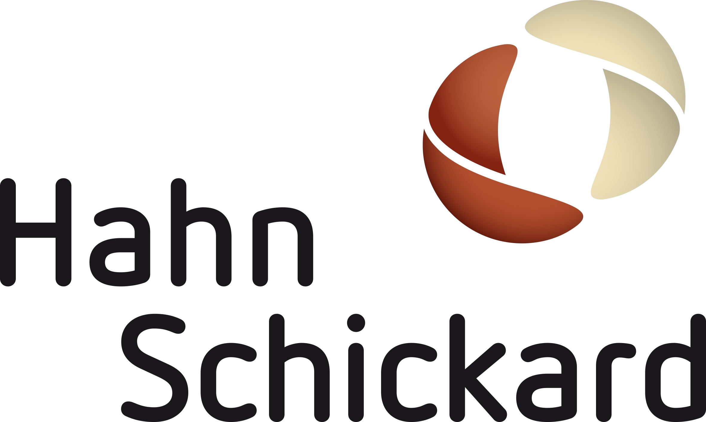

# LwM2M Technology Adapter
## Brief description

Implements a Technology Adapter for Lighweight Machine To Machine (LwM2M) Communications protocol. The adapter functions as a LwM2M Server and uses [Hahn-Schickar LwM2M Server for C++17](https://git.hahn-schickard.de/hahn-schickard/software-sollutions/application-engineering/internal/cpp-projects/lwm2m/lwm2m-server) implementation.

## Required dependencies
* [Python 3.7](https://www.python.org/downloads/release/python-370/)
* [conan](https://docs.conan.io/en/latest/installation.html)
